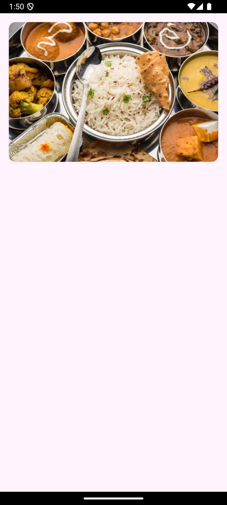
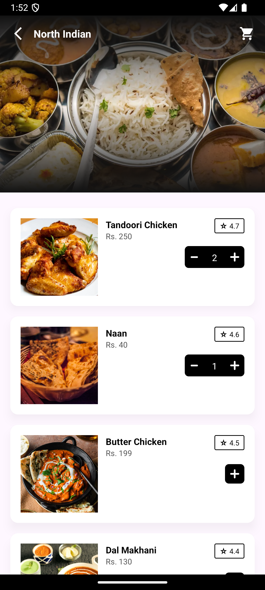
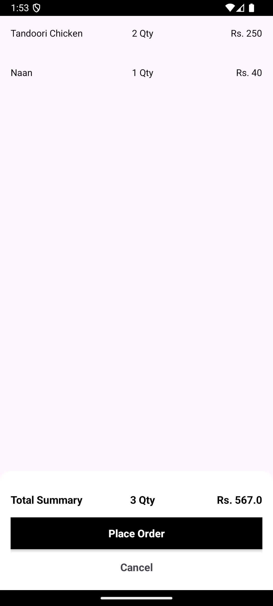

#  📲 OneBanc Android Task

An Android app showcasing popular cuisine in the restaurant industry using the API. Features include infinite scrolling, cuisine info, and final summary with sgst & cgst.

## 🚀 Features
- **Details View**: Display cuisine info and a list of recipes.
- **Image Loading**: Efficiently load images with Glide and custom BindingAdapter.
- **Popular cuisine List**: Infinite scrolling using a custom pagination listener.

## ⚙ Technologies & Libraries
- **MVVM Architecture**: Separation of concerns with ViewModel and LiveData.
- **Retrofit 2**: Network requests to TMDB API.
- **Glide**: Image loading and caching.
- **DataBinding**: UI binding with custom adapters.

## 📷 Screenshots
&nbsp;&nbsp;



## 💻 Permissions
- Internet

## 📝 Image Loading with Glide and custom BindingAdapter

```
@JvmStatic
@BindingAdapter("load_image")
fun loadImage(imageView: ImageView, url: String?) {
    Glide.with(imageView.context)
        .load(url) // image url
        .placeholder(R.drawable.placeholder_dark) // any placeholder to load at start
        .error(R.drawable.placeholder_dark) // any image in case of error
        .centerCrop()
        .into(imageView)
}
```


